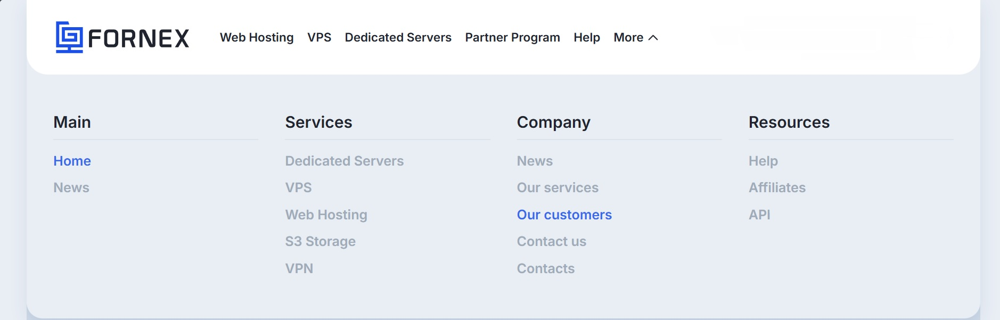
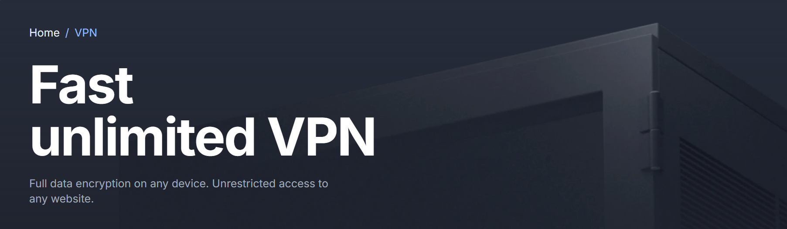

# Unlimited Internet Without Borders

## Premium VPN and Powerful Hosting by Fornex

Hello friends!

In today’s world the internet is everything: work, communication, entertainment, shopping, education and investing.

We watch videos on **YouTube**, scroll **Instagram** and **TikTok**, code on **GitHub**, listen to **Spotify**, stream movies on **Netflix**, and shop on **Amazon** or **eBay**.

For many people the internet is also connected with **cryptocurrency**:

- trading on Binance, Bybit and OKX  
- DeFi farming (Uniswap, Raydium)  
- staking  
- running blockchain nodes  
- analytics on CoinMarketCap and TradingView  

However, users often face problems:

- video buffering even with good internet  
- region restrictions on websites  
- slow social networks  
- crypto exchanges limiting access  
- unstable servers for running nodes  

Fortunately, there is a solution — the European infrastructure provider **Fornex**.

---

## Why VPN Is Essential Today

Many users experience problems such as:

- YouTube buffering even with fast internet  
- Instagram and TikTok loading slowly  
- developer websites sometimes blocked  
- Netflix showing limited catalogs  
- Spotify restricting music by region  
- public Wi-Fi networks being unsafe  

A VPN helps solve these issues.

---

## What Is Fornex

Fornex is a European infrastructure provider with **more than 16 years of experience**.

The company offers:

- VPN services  
- VPS servers  
- dedicated servers  
- web hosting  
- infrastructure for crypto nodes  
- DDoS protection  

Fornex is suitable for:

- regular internet users  
- developers  
- crypto traders  
- website owners  
- blockchain projects  

---

## Fornex VPN Features

Fornex VPN provides:

- unlimited traffic  
- high-speed connections  
- servers across Europe and other regions  
- Multi-Hop connection support  
- modern VPN protocols  

Supported technologies include:

- WireGuard  
- XRay  
- Outline  
- IKEv2  
- OpenVPN  

Additional security features:

- strong encryption  
- IP protection  
- strict **No-Logs policy**

With Fornex VPN:

- YouTube streams in maximum quality  
- social media loads faster  
- GitHub opens instantly  
- streaming services unlock full catalogs  

---

## VPN for Crypto Users

Cryptocurrency infrastructure requires stability and speed.

Using VPN from Fornex allows you to:

- access Binance, Bybit, Coinbase and KuCoin  
- trade without delays  
- use DeFi services without restrictions  
- read analytics and market news safely  

---

## VPS and Dedicated Servers

Fornex also offers powerful VPS solutions:

- KVM virtualization  
- dedicated resources  
- full root access  
- up to 16 CPU cores  
- up to 640GB NVMe storage  

Perfect for:

- blockchain nodes  
- staking infrastructure  
- testing environments  
- server applications  

The company also provides **high-performance Intel and AMD dedicated servers**.

---

## Infrastructure Advantages

Fornex infrastructure includes:

- **DDoS protection up to 10 Gbit/s**  
- low network latency  
- data centers in Europe and the USA  

Available locations:

- Germany  
- Netherlands  
- Sweden  
- Spain  
- Switzerland  
- USA  

Infrastructure reliability reaches **99.99% uptime**.

---

## Complete Infrastructure Ecosystem

Fornex provides a full ecosystem of services:

- VPN  
- web hosting  
- VPS servers  
- dedicated servers  
- DDoS protection  
- backup solutions  

All servers use **NVMe storage for maximum performance**.

Support is available **24/7**, with an average response time of **3–5 minutes**.

The company also offers a **7-day money-back guarantee**.

---

## Get a 10% Discount

Use my referral link and receive a **permanent 10% discount on all Fornex services**.

The discount applies to:

- VPN services  
- web hosting  
- VPS servers  
- dedicated servers  
- DDoS protection  

👉 **[Get 10% Discount](https://fornex.com/code/v1j0nv/)**

---

## Final Thoughts

Fornex is a complete infrastructure solution for modern internet users:

- fast and private VPN  
- stable access to websites  
- professional infrastructure for developers  
- powerful hosting for blockchain and crypto nodes  

If you need reliable internet infrastructure, **Fornex is definitely worth trying**.
