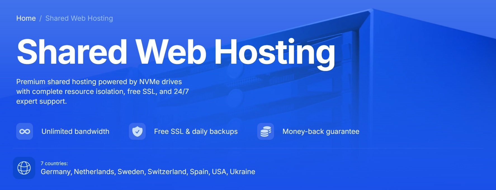

<a href="https://odessacool1.github.io/my-vpn-blog/">🇷🇺 Русский</a> | 🇺🇸 <b>English</b>

<a href="https://odessacool1.github.io/vpn-global-blog/crypto-airdrops-2026" style="display:inline-block;padding:10px 18px;background:#ff7a00;color:white;text-decoration:none;border-radius:8px;font-weight:bold;box-shadow: 0 4px 14px rgba(255,122,0,0.4);">
🎁 Airdrops 2026
</a>

# 🌐 Unlimited Internet Without Borders 2026

> **Quick Access:** [🔥 Best VPN 2026 Guide](vpn-guide-2026.html)

## 🚀 Premium VPN & Infrastructure by Fornex

Hello friends! In 2026, the internet is no longer just a luxury—it's our primary ecosystem for **work, investing, and freedom.**

Whether you are coding on **GitHub**, streaming 4K content on **Netflix**, or managing assets on **Binance**, you need a connection that is both invisible and invincible.

### The Challenges We Face:
* ⏳ **Buffering:** Even with high-speed fiber, YouTube or TikTok can lag due to routing.
* 🚫 **Geo-Blocks:** Regional restrictions on exchanges like OKX or Bybit.
* 🔒 **Security:** Unsafe public Wi-Fi or tracking by ISPs.
* 📉 **Latency:** High ping during critical trading sessions or DeFi swaps.

---

## 🛡️ Why Fornex is the Solution

Fornex is a European infrastructure leader with **over 16 years of expertise**. It’s not just a VPN provider; it's a full-scale digital fortress.

### ⚡ Fornex VPN Key Features:
* **Unmatched Speed:** Unlimited traffic on ultra-fast European nodes.
* **Top-Tier Privacy:** A strict **No-Logs Policy**—your data stays yours.
* **Next-Gen Protocols:** * `WireGuard` (Speed)
    * `XRay / VLESS` (Stealth)
    * `Outline` (Simplicity)
* **Entertainment:** Instant access to global Netflix libraries and 4K YouTube streaming.

---

## 📊 Infrastructure for Crypto & Devs

If you are serious about **Web3**, a basic VPN isn't enough. You need professional-grade stability.

| Service | Best For | Features |
| :--- | :--- | :--- |
| **VPN** | Traders & Browsing | Multi-Hop, High Anonymity |
| **VPS** | Staking & Nodes | NVMe Storage, Root Access |
| **Dedicated** | Large Projects | AMD Epyc / Intel Xeon Power |

### For Crypto Enthusiasts:
* **Exchange Access:** Seamless connection to Binance, Bybit, and Coinbase.
* **DeFi Ready:** Fast execution on Uniswap, Raydium, and PancakeSwap.
* **Node Hosting:** Run Ethereum, Solana, or Layer-2 nodes on high-uptime servers.

---

## 🌍 Global Data Centers
Fornex operates in the most strategic jurisdictions for privacy and speed:
🇩🇪 **Germany** | 🇳🇱 **Netherlands** | 🇸🇪 **Sweden** | 🇪🇸 **Spain** | 🇨🇭 **Switzerland** | 🇺🇸 **USA**

> **Uptime Guarantee:** 99.99% availability with 24/7 technical support (response time: 3-5 mins).

---

## 🎁 Exclusive 10% Lifetime Discount

As a partner, I can offer you a permanent **10% discount** on all Fornex services. This isn't a one-time coupon; it stays with you for as long as you use the service.

### Eligible Services:
* ✅ All VPN Tiers
* ✅ Shared & Web Hosting
* ✅ High-Performance VPS
* ✅ Dedicated Servers & DDoS Protection

👉 **[CLAIM YOUR 10% DISCOUNT NOW](https://fornex.com/code/v1j0nv/)**

---

## 📚 Deep Dive Guides

Looking for specific setups? Check out our specialized tutorials:

* 🔗 [Best VPN for Crypto Trading](vpn-for-crypto.md)
* 🔗 [Binance Safety Guide](vpn-for-binance.md)
* 🔗 [Developer's Guide to Secure SSH](vpn-for-developers.md)
* 🔗 [GitHub & CI/CD Stability](vpn-for-github.md)
* 🔗 [Low-Latency Trading VPS](vpn-for-trading.md)

---

  <i>© 2026 Global Privacy Project. Secured by Fornex.</i>

