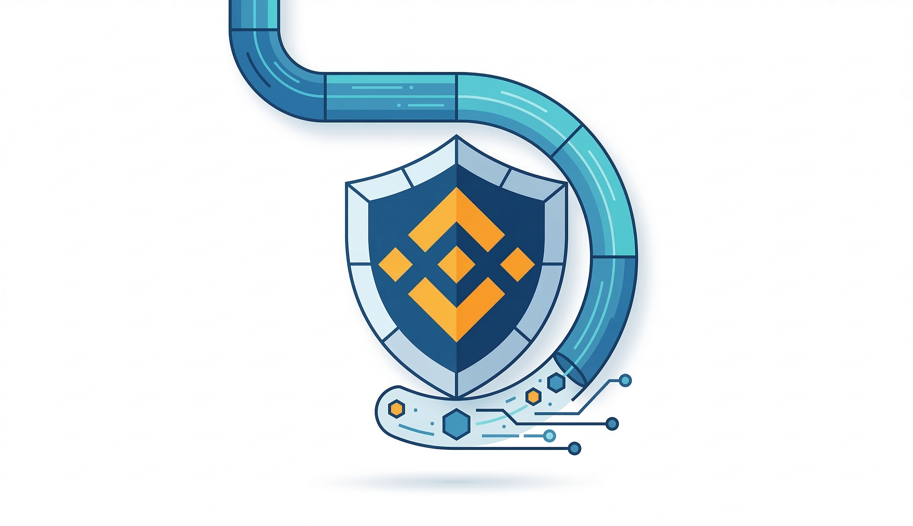

<a href="https://odessacool1.github.io/my-vpn-blog/">🇷🇺 Русский</a> | <b>🇺🇸 English</b>

# VPN for Binance: Why Traders Use It for Security and Stability

👉 **[Get 10% Off](https://fornex.com/code/v1j0nv/)**

---

## Why Binance Users Use VPNs

Binance is one of the largest crypto exchanges in the world.  
Millions of users log in daily to trade, monitor positions, manage portfolios, and access market tools.

However, when working with crypto accounts, users often care about:

- connection security
- login privacy
- public Wi-Fi risks
- stable platform access
- safe access while traveling

A VPN helps create a **protected internet connection**, which can improve privacy and reduce network-related risks.

---

## Risks of Using Exchanges Without Added Network Protection

Without extra protection, users may run into issues such as:

- unsafe public Wi-Fi
- ISP-level activity visibility
- unstable routing
- slower access to exchange interfaces
- connection inconsistency during important sessions

This matters even more for active traders who log in frequently and manage funds regularly.

A VPN adds a **secure encrypted layer** between the user and the internet.

---

## Why a VPN Can Be Useful for Binance

Some Binance users rely on VPNs for practical reasons such as:

- safer connection while logging in
- added privacy when using public networks
- more stable access to trading tools
- reduced exposure of IP-based activity

A VPN is a **security and privacy tool**, not a method to bypass exchange rules.  
Users should always follow Binance terms, regional requirements, and KYC policies.

---

## Why Stable Connectivity Matters in Trading

For active traders, network stability matters almost as much as strategy.

Poor connectivity can lead to:

- slow interface loading
- delayed chart updates
- unstable order management
- interruptions during analysis

Using a stable VPN provider can improve routing quality and make access more consistent.

---

## Why Fornex Fits Binance Users

Fornex offers infrastructure that works well for crypto-focused users.

Main advantages:

- high connection speed
- modern protocols
- unlimited traffic
- European and global server locations
- No-Logs policy
- strong encryption

Supported technologies:

- WireGuard
- OpenVPN
- IKEv2
- XRay
- Outline

That makes it suitable for exchange access, crypto research, and privacy-focused use.

---

## VPS for Bots and Trading Infrastructure

Fornex also provides VPS and dedicated servers.

This can be useful for:

- running trading bots
- remote monitoring
- automation
- test environments
- technical crypto workflows

Main VPS benefits:

- KVM virtualization
- root access
- NVMe disks
- dedicated resources
- high performance

---

## Server Locations and Stability

Fornex has infrastructure in several countries, including:

- Germany
- Netherlands
- Sweden
- Spain
- Switzerland
- USA

This helps provide:

- lower latency
- stable access
- location flexibility
- strong network performance

DDoS protection and 24/7 support are also available.

---

## Get 10% Off

If you want to try Fornex, you can use the link below.

👉 **[Get 10% Off](https://fornex.com/code/v1j0nv/)**

The discount applies to:

- VPN
- VPS
- dedicated servers
- web hosting
- DDoS protection

---

## Final Thoughts

If you need a **VPN for Binance**, trading, and safer exchange access, Fornex offers:

- fast VPN access
- more stable connectivity
- privacy and encryption
- VPS for bots and automation
- European infrastructure

For traders and active crypto users, it can be a practical security tool.
